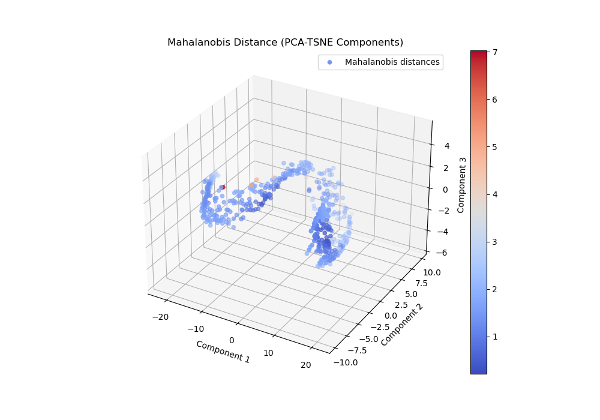

# outlier_detection_mahalanobis
Outlier detection using Mahalanobis distances.

- Mahalanobis distance measures how far a point is from a distribution, accounting for the covariance between features.
- For each data point, compute its Mahalanobis distance from the mean — if the distance exceeds a chosen threshold it is an outlier.
- Determine threshold based on chi-squared distrubution.

<figure>
    
    <figcaption>Figure 1: Mahalonbis Distances.</figcaption>
</figure>

- Data points in red have the largest distance and depending on threhsold are outliers.
