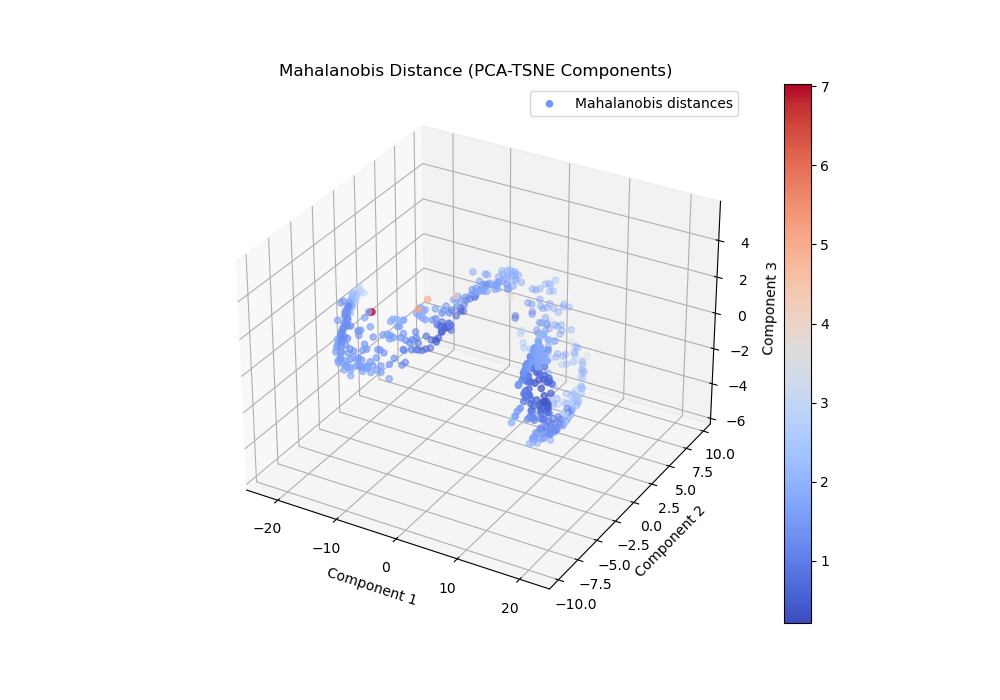

# Outlier Detection with Mahalanobis Distance

Detects outliers in labeled tabular data using Mahalanobis distance, applied per class after PCA and t-SNE dimensionality reduction.

## Method

Mahalanobis distance measures how far a point lies from the center of its distribution, accounting for feature covariance. Unlike Euclidean distance, it is scale-invariant and captures correlations between features — making it well-suited for multivariate outlier detection.

For each class in the dataset:
1. Compute the class mean and inverse covariance matrix.
2. Calculate each sample's Mahalanobis distance from the class mean.
3. Flag samples exceeding a chi-squared threshold (default: α = 0.05) as outliers.

Dimensionality is reduced prior to detection — PCA to 15 components, then t-SNE to 3 — both to improve computational stability and to produce a 3D visualization.

## Results

<figure>
    
    <figcaption>Figure 1: Mahalanobis distances projected onto t-SNE components. Points in red have the largest distances from their class center and are flagged as outliers.</figcaption>
</figure>

## Data

Breast cancer dataset from [Kaggle](https://www.kaggle.com/datasets/uciml/breast-cancer-wisconsin-data) (UCI ML Repository). Features are continuous cell nucleus measurements; the label (`diagnosis`) is binary: malignant (M) or benign (B).

## Usage

```bash
uv run outlier_detection.py
```

## Dependencies

Managed with [uv](https://github.com/astral-sh/uv). Key packages: `numpy`, `scipy`, `scikit-learn`, `pandas`, `matplotlib`.
